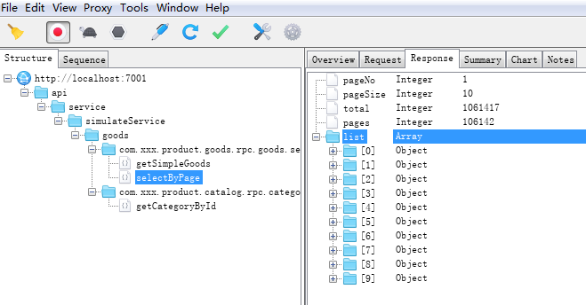

# egg-dubbo

[![NPM version][npm-image]][npm-url]
[![build status][travis-image]][travis-url]
[![Test coverage][codecov-image]][codecov-url]
[![David deps][david-image]][david-url]
[![Known Vulnerabilities][snyk-image]][snyk-url]

[npm-image]: https://img.shields.io/npm/v/egg.svg?style=flat-square
[npm-url]: https://npmjs.org/package/egg
[quality-image]: http://npm.packagequality.com/shield/egg.svg?style=flat-square
[quality-url]: http://packagequality.com/#?package=egg
[travis-image]: https://img.shields.io/travis/eggjs/egg.svg?style=flat-square
[travis-url]: https://travis-ci.org/eggjs/egg
[codecov-image]: https://img.shields.io/codecov/c/github/eggjs/egg.svg?style=flat-square
[codecov-url]: https://codecov.io/gh/eggjs/egg
[david-image]: https://img.shields.io/david/eggjs/egg.svg?style=flat-square
[david-url]: https://david-dm.org/eggjs/egg
[snyk-image]: https://snyk.io/test/npm/egg/badge.svg?style=flat-square
[snyk-url]: https://snyk.io/test/npm/egg
[download-image]: https://img.shields.io/npm/dm/egg.svg?style=flat-square
[download-url]: https://npmjs.org/package/egg
[gitter-image]: https://img.shields.io/gitter/room/eggjs/egg.svg?style=flat-square
[gitter-url]: https://gitter.im/eggjs/egg

<!--
Description here.
-->
## Egg连接Dubbo服务插件

## Install

```bash
$ npm i egg-dubbo --save
```

## Usage

```js
// {app_root}/config/plugin.js
exports.eggDubbo = {
  enable: true,
  package: 'egg-dubbo',
};
```

## Configuration

```js
// {app_root}/config/config.default.js
exports.dubbo = {
  // 默认服务版本
  version: '2.0.0',
  // 默认超时时间
  timeout: 6000,
  // 服务列表
  list: {
      // 多服务配置, 例如goods表示商品系统应用的服务
      goods: {
          applicationName: 'your_application_ame',
          register: 'your_zk_service',
          dubboVer: '2.5.3'
      }
  }
};
```

see [config/config.default.js](config/config.default.js) for more detail.

## Example
#### 1.存放服务文件于app/service/rpc目录


#### 2.每个服务文件格式,以GoodsRpcService.js为例：
```js
'use strict';

module.exports = (app) => {

  /**
   * 商品RPC服务
   */
  class GoodsRpcService extends app.RpcService {
    constructor() {
      super(app);
      this.channel = 'goods'; // 自定义频道列表
      this.interfaceUrl = 'com.xxx.product.goods.rpc.goods.service.RpcGoodsService'; // JAVA服务类
    }

    // ========= 业务签名 ========
    /**
     * 注册方法签名
     */
    signature() {
      this.methodSignature = {

        // 依据商品ID获取商品信息
        getSimpleGoods: (goodsId) => [{
          '$class': 'java.lang.Long',
          '$': goodsId
        }],

        // 依据商品对像查询商品关联列表
        selectByPage: (good) => [
          {
            $class: 'com.xxx.product.goods.rpc.goods.query.RpcGoodsInfoQuery',
            $: {
                cid: { $class: 'java.lang.Long', $: good.cid },
                pageNo: { $class: 'java.lang.Integer', $: good.pageNo },
                pageSize: { $class: 'java.lang.Integer', $: good.pageSize }
            }
          }
        ]
        
      };
    }
    // ========= 业务签名 ========


    // ======== 业务接口 =========
     /**
     * 简单传参示例
     * @param {*} goodsId 
     */
    * getSimpleGoods(goodsId) {
      const resultData = yield this.request('getSimpleGoods', goodsId);

      return resultData;
    }

    /**
     * 复杂传参示例
     * @param {*} cid 
     * @param {*} pageNo 
     * @param {*} pageSize 
     */
    * selectByPage(cid, pageNo, pageSize) {
        const resultData = yield this.request('selectByPage', {
            cid,
            pageNo,
            pageSize
        });

        return resultData;
    }
    // ======== 业务接口 =========

  }

  // 注册服务
  app.goodsService = new GoodsRpcService(app);
  app.goodsService.update();
  
};
```
#### 服务调用：
```js
  /**
   * 服务调用示例
   * @param {*} goodsId 
   */
  * getSimpleGoods(goodsId) {
      const resultData = yield this.app.goodsService.getSimpleGoods(goodsId);

      return resultData;
  }
```

### 本地Charles调试输出



## Questions & Suggestions

Please open an issue [here](https://github.com/eggjs/egg/issues).

## License

[MIT](LICENSE)
